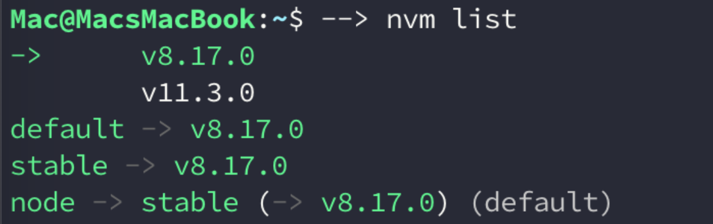
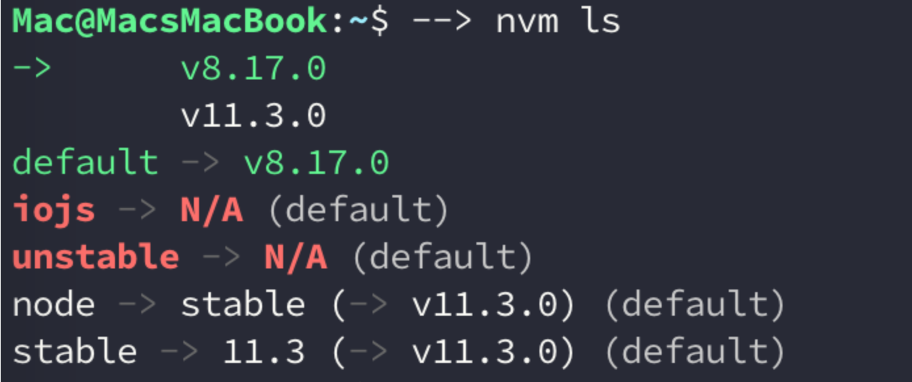

# Node.js Setup on Mac

> 昨天晚上，受够去年装乱七八糟的Node.js, 打算重装了Node.js。虽然这过程里也有点波折。
>
> 记录以警示后来人少走弯路。


整个流程是这样子滴。

nvm(Homebrew) -> node(npm) -> hero-cli

<!--more-->

大致分为三步走。如果你用Mac没装Homebrew,那请上 <u>[homebrew官网安装](https://brew.sh/)</u>

> Friendly-note: 
>
> 由于这片土地的特殊性，以及防止遇到一些奇奇乖乖的出错，最好自备科学上网环境，以及终端走代理技能。

两个坑：1）brew装nvm，重启终端后nvm失效 2）终端重启后，通过nvm安装的node、npm失效


### 安装nvm

装完`homebrew`，如果你成功的话。

安装nvm，十分简单。只需要一句话。

```bash
brew install nvm #这里会自动执行brew update命令，然后执行该命令。

```

由于外网，update整个过程需要等很久。大概要3-4分钟，甚至更久。所以，耐心等待，切不要重蹈我以前的覆辙，莽断地按下Ctrl+C结束。这会导致很严重的后果---可能再也运行不了brew命令。所以，最好走代理。

安装成功后，会有一个bug, 

#### **坑1: brew装nvm，重启终端后nvm失效**

brew安装nvm有个bug，安装时缺少了nvm.sh，这会导致每次重启终端，nvm命令就失效了，所以我们要每次运行下面的命令：

```bash
// 复制下面的代码到终端并运行
export NVM_DIR=~/.nvm
source $(brew --prefix nvm)/nvm.sh
```

好了，现在nvm命令已经能被识别了，但是每次重启终端都要运行无疑是很复杂的，所以要在`.bash_profile`（`～/.zshrc`）中配置一下，保证每次重启时，系统都能帮我们做一步。

```bash
#edit on .bash_profile
#setup NVM_DIR
export NVM_DIR="~/.nvm"
source $(brew --prefix nvm)/nvm.sh
```

测试是否成功

```bash
nvm -v #显示版本号
```


### 安装node以及配置

这部分，应该算是最曲折的。

#### 使用nvm安装node

安装node,命令依次是

```bash
nvm ls-remote # 查看当前提供node版本号
nvm install v8.11.3 # 自由选择 我选择了stable版本
# 安装完成后就可以查看node和npm的版本了
node -v  
npm -v
```

> npm直接跟着node一起去安装进去，虽然两者没什么依赖关系。

安装过程较慢，特别是安装node,得有耐心等待⌛️

#### **坑2：终端重启后，通过nvm安装的node、npm失效**

重启终端之后，node和npm也失效了. **不要急着关掉终端！！！**

这是因为nvm没有默认绑定node的版本号，所以要手动绑定一下。

如果你还没有重启，node和npm命令还有效，那么直接运行下面的命令，如果已经无效，先重新用nvm安装node

```bash
nvm use v8.11.3 #设置默认版本号
#绑定默认版本号,稳定版本号
nvm alias default v8.11.3 
nvm alias stable v8.11.3 #如果下载的不是stable版的话，需要此条命令
nvm ls
```

然后check一下，看到如下截图




###### 例外情况

Note: 而我的情况，并没有遵循上面所说那样，下载个node稳定版v8.11.3,相反下载了lts/carbon项目最新版，之后就出现没有全绑定问题，即stable版本并没有使用默认版，相反使用node原先预设的v11.3.0。



应该使用 `nvm alias stable v8.17.0`命令解决


这样子, node的配置已经完成。

### 安装hexo-cli

一条命令，搞掂。

```bash
npm install -g hexo-cli #全局安装
```

不过下载有点慢，建议代理！

安装完后，check下是否安装成功

```bash
hexo -v #版本信息
```

> 有些人，可能会出现"command not found"的问题。如果安装完成的话，可能就是下到node另一个版本的node-modules文件夹去了。npm下载插件，默认存到当前系统node稳定版上去。所以说，如果出现该问题，最好检查下。(其中，/bin/hexo-二进制可执行文件，即命令。没有它，就会出现"命令不存在"的报错。)
>
> 解决：放回文件的正确位置。尝试把 node-modules/hexo-cli 和 ../bin/hexo 两个全部移入当前使用的node版本去。
>
> （特别对于那些.nvm/version/文件夹下存在多个node版本的人来说，或者上面node绑定时，没有出现上面三个全绿的截图。) 


### 参考资料

1. [segmentfault-一篇文章了解Mac上Node环境配置](https://segmentfault.com/a/1190000015416829)

2. [Mupceet-Hexo 博客搭建与主题配置（零基础版）](https://mupceet.com/2019/08/build-blog-based-on-hexo/)

